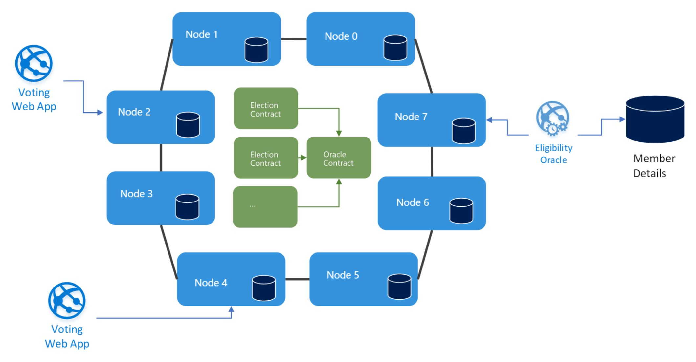

# voting-oracle
A simple voting oracle to demonstrate the Oracle pattern in Solidity

Note: Only supports TestRPC (No unlocking or signing is included)



## Smart Contracts
### [Election.sol](truffle/contracts/Election.sol)
The Election contract manages an end-to-end election (or ballot). A new contract is created for each new election that occurs and it holds a collection of votes made by various addresses.

### [EligibilityOracle.sol](truffle/contracts/EligibilityOracle.sol)
A singleton Contract (meaning there should only ever be one of these in the whole network) that is responsible for marshalling calls to the off-chain eligibility oracle service.

Of course, smart contracts can't make external calls, so what appears to be an external call is in-fact an Event publication with a unique identifier followed by am independent transaction to the Oracle Contract with that same identifier coupled with any external data requested.

## Command-line Voting Apps and Oracles
To keep this demo as simple as possible, all the external apps are node.js command-line scripts.

### Voting
The voting app is simulated with a node.js command-line script that uses web3 (0.20.0) to send votes into the [Election contract](truffle/contracts/Election.sol).

[vote.js](node/vote.js) requires two parameters, the address of the Election contract you are voting in and the address of the voter account.

```
node vote.js {election contract address} {voter address}
node vote.js 0x12345 0x67890
```

Once a vote is completed, the script watches the Election contract and provides feedback on voting and Eligibility requests as they are finalised by the Oracle.

```
 TODO : Command-line output of the voter goes here
```

### Eligibility Oracle

The Eligibility Oracle is also simulated by a node.js command-line script that uses web3 (0.20.0) to watch events fired from the [Eligibility Oracle contract](truffle/contracts/EligibilityOracle.sol).

[watch.js](node/watch.js)

watch.js takes two parameters, the first in the address to the oracle contract and the second is the address that the Oracle uses to sign transactions.

```
node watch.js {oracle contract address} {oracle account address}
node watch.js 0x78453 0x89856
```
These events represent a request to determine the eligibility of a vote. The Oracle determines the voters eligibility by simpling forming a rudimentary voters roll from the accounts registered with the Oracle's node on the network and defines all even numbered account index positions as being eligible.

```javascript
var voters = web3.eth.accounts.filter((element, index) => index % 2 === 0);
```
The response to the [Oracle contract](truffle/contracts/EligibilityOracle.sol) is in the form of a transacted call to the 'reply' function and provides an eligibility flag.

The Oracle contract then matches the original request to this response and calls the referenced callback function on the Election contract.

The ability to provide function references in Solidity is effectively what allows for this Oracle pattern to work. 

## Deployment
Create a folder and clone this repository
```
git clone https://github.com/walteriousnut/voting-oracle.git
```

### Truffle

This sample used [Truffle](http://truffleframework.com/) to deploy the smart contracts, but is not required. You could deploy them [manually](https://www.ethereum.org/greeter), with [Remix](https://remix.ethereum.org/) or any other tool.

If you are using truffle:
```
cd voting-oracle/truffle
truffle compile
```

The compile process shiould produce this output
```
Compiling .\contracts\Election.sol...
Compiling .\contracts\EligibilityOracle.sol...
Compiling .\contracts\Migrations.sol...
Writing artifacts to .\build\contracts
```

Before deploying, make sure the truffle.js file is pointing at the RPC endpoint of your ethereum network or your instance of TestRPC.

```
module.exports = {
  networks: {
    development: {
      host: "localhost",
      port: 8545,
      network_id: "*" // Match any network id
    }
  }
};
```

### TestRPC
Before deploying the contracts, you need to have somewhere to deploy them to.

To avoid the complexity of a real Ethereum network so that this demo can focus on the Oracle pattern, I'm using [TestRPC](https://github.com/ethereumjs/testrpc).

TestRPC is an in-memory implementation of the Ethereum spec, it's not a full implementation, but certainly enough to run most contracts and interact over RPC.
It's perfect for unit testing contracts.

My TestRPC instance created these accounts:

```
(0) 0xf6fb16b045b12511abb4aa405457e1be475b0c55
(1) 0x02d1057e87efcc2a7b4b624ad4606f3928942f42
(2) 0x39d7a0049f2728820844507d6d012b844252fbfc
(3) 0xebf3d5518cca85f79b9df3ac306f62288dba0090
(4) 0x7817096c34e13d15fb9c02b8b2b315f62b4b998b
(5) 0xeca977684dcd95f629495344163c0bd5322dd9b2
(6) 0xde13dddc8077a63c7264b36658061dbd70639b96
(7) 0x6dac542ac0430215367b1c49a11301cad91cf7de
(8) 0xe74d70d0fc8a5350c6c2a43cea21aae1b7a311a6
(9) 0x689ed2b02b85ee267f9da09b5da202cf3ac9a463
```

### Deployment Sequence
Regardless of how you deploy the contract, it's important to deploy the Oracle contract first. Because the Election contracts need to reference the Oracle.

Once the Oracle contract is deployed, you need to update this line in the Election contract to reference the deployed Oracle contract's address instead of the 0x5d22... address shown.

```
EligibilityOracle constant oracle = EligibilityOracle(0x5d22c7dc940f976d229c8f9be86964b7f90d922a);
```

### Truffle Migrations
Truffle uses migration scripts to describe the deployment pipeline for contracts. These can be found in the Truffle/Migrations.

```
truffle migrate
```

After running truffle migrate, you'll notice it has executed the 3 migration scripts and provides the addresses for the contracts deployed.
```
Using network 'development'.

Running migration: 1_initial_migration.js
  Deploying Migrations...
  Migrations: 0x97b14f7e6c4c9ae1b5be449d5c1bf090bc0a2f36
Saving successful migration to network...
Saving artifacts...
Running migration: 2_deploy_contracts.js
  Deploying EligibilityOracle...
  EligibilityOracle: 0x6cef14531752e6a126ffecaa795e15df29fbab9a
Saving successful migration to network...
Saving artifacts...
Running migration: 3_deploy_election.js
  Deploying Election...
  Election: 0xcef084fbd97d9cfb5935891425b77e1b6ff5a5d3
Saving successful migration to network...
Saving artifacts...
```

After running truffle migrate, you'll need to copy the address for the EligibilityOracle and update contracts/Election.sol to reference the correct Oracle.

In the case of the deployment described above, the reference in Election.sol would now read:

```
EligibilityOracle constant oracle = EligibilityOracle(0x6cef14531752e6a126ffecaa795e15df29fbab9a);
```
Now you need to create a new migration script (assuming you deploy the contract with Truffle).
```
cd truffle/migrations
cp 3_deploy_election.js 4_deploy_election_again.js
```

Run
```
truffle migrate
```
again, and you should see
```
Compiling .\contracts\Election.sol...
Compiling .\contracts\EligibilityOracle.sol...
Writing artifacts to .\build\contracts

Using network 'development'.

Running migration: 4_deploy_election_again.js
  Replacing Election...
  Election: 0x0b5a9127a59900a00de66a6908c5428fac16469f
Saving successful migration to network...
Saving artifacts...
```

## Node
You'll need Node.js to run the node scripts, so use the instructions for your OS to install node.

After you've installed Node.js you'll need to install web3 (v 0.20.0) and bignumbers.js.

Web3 recently made v1 beta the stable, current build of web3. This demo doesn't use the newer web3 APIs but will as soon as web3 v1 supports subscribing to contract events over HTTP so that it can use TestRPC.

```
(from the voting-oracle directory)
cd node
npm install web3@0.20.0
npm install bignumber.js
```

## Starting the Oracle
Now that the contracts are deployed to your network, you can start the Oracle

I'll use account 0 for the Oracle's account and demonstrate voting with some of the others.

To start the Oracle:
```
(from the voting-oracle directory)
cd node
node watch.js 0x6cef14531752e6a126ffecaa795e15df29fbab9a 0xf6fb16b045b12511abb4aa405457e1be475b0c55
```

Output should be as follows:
```
Network contains + 10 voters.

The following voters are eligible 0xf6fb16b045b12511abb4aa405457e1be475b0c55,0x39d7a0049f2728820844507d6d012b844252fbfc,
0x7817096c34e13d15fb9c02b8b2b315f62b4b998b,0xde13dddc8077a63c7264b36658061dbd70639b96,0xe74d70d0fc8a5350c6c2a43cea21aae1
b7a311a6


Oracle is watching. Hit any key to exit.
```
Don't hit any key, obviously.

## Doing some voting
In another console, we now do some voting.

```
(from the voting-oracle directory)
cd node
node vote.js 0x0b5a9127a59900a00de66a6908c5428fac16469f 0x02d1057e87efcc2a7b4b624ad4606f3928942f42

Placing Vote for: [0x02d1057e87efcc2a7b4b624ad4606f3928942f42]

Vote Submitted, watching Election ... Hit any key to exit.
 0x80573d6dec29f8535fdcc451d99610a98d699e3037a14f4f39edd7b167eddd14 
```

On the Oracle terminal you should receive:
```
-----------------------------
Received Eligibility Check #0 for: 0x02d1057e87efcc2a7b4b624ad4606f3928942f42
Voter in Ineligible.
----------------------------

Replying to the Oracle Contract ...
----------------------------

0x24c1e131b359704447a4f91585138391f83dc041a40573d0571db721809a338b
```

And once that transaction is confirmed, you'll get this on the voting console (because after voting, it listens for the finalise event in the Election)

```
A Vote was Finalised
Total: 1
Unconfirmed: 0
Ineligible: 1
Confirmed: 0
-----------------------------
```

If you send another vote from a new console, the previous vote console will continue to watch the election and report on the election totals as the Oracle confirms eligibility.

Here's what that looks like:

On the new console:
```
node vote.js 0x0b5a9127a59900a00de66a6908c5428fac16469f 0x39d7a0049f2728820844507d6d012b844252fbfc

Placing Vote for: [0x39d7a0049f2728820844507d6d012b844252fbfc]

Vote Submitted, watching Election ... Hit any key to exit.
 0x14f0580f78049d316067d9ea54455dfa7af6db3ebfb5e53ab443490f90943b74
```

On the Oracle we received the second request:
```
-----------------------------
Received Eligibility Check #1 for: 0x39d7a0049f2728820844507d6d012b844252fbfc
Voter is Eligible.
----------------------------

Replying to the Oracle Contract ...
----------------------------

0x9bd66d78bffd426a8b8994e7654a0f9e674f69dc91ad425d58ec150021c9fc9c
```

And on the original voter console, where it s was left to watch the Election:
```
A Vote was Finalised
Total: 2
Unconfirmed: 0
Ineligible: 1
Confirmed: 1
-----------------------------
```
